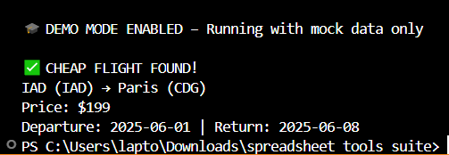

# ✈️ Flight Club – Spreadsheet Tools Suite

A real-world Python project that scans live flight deals using the Amadeus API, checks them against your personal budget, and sends email alerts if prices drop below your threshold. This project integrates Google Sheets (via Sheety API) as a lightweight backend for destinations, supports both real and demo modes, and is structured to showcase clean, production-quality code.

🧩 This is one of three tools in the **Spreadsheet Tools Suite**, a collection of real-world Python automation projects using Google Sheets as a lightweight backend.

---

## 🧪 Demo Mode Included

Recruiters or reviewers can run the app **without needing API keys or setup** by enabling demo mode in `main.py`:

```python
DEMO_MODE = True
```

This prints a realistic mock flight deal with no external API calls.

---

## 🚀 Features

- ✅ Real-time flight searches via Amadeus API  
- ✅ Automated price comparison to user-defined thresholds  
- ✅ Email alerts for deals below budget  
- ✅ Google Sheets integration via Sheety for backend data storage  
- ✅ Demo mode for easy testing (no API required)  
- ✅ Secure `.env` usage with `.env.example` provided  
- ✅ Clean, modular Python codebase for easy extension  

---

## 📂 Project Structure

```
flight_club/
├── main.py                  # Entry point with demo mode toggle
├── flight_data.py           # FlightData class to store flight info
├── flight_search.py         # Logic to search for flights via Amadeus
├── data_manager.py          # Reads/writes to Google Sheet via Sheety
├── notification_manager.py  # Sends email alerts
├── .env.example             # Example of required environment variables
├── .gitignore               # Ensures .env and compiled files are excluded
└── requirements.txt         # Python dependencies
```

---

## 📸 Screenshot



---

## 🔒 Environment Variables

Create a `.env` file with the following keys:

```
SHEET_ENDPOINT=https://api.sheety.co/YOUR_ENDPOINT_HERE
AMADEUS_CLIENT_ID=your_amadeus_client_id
AMADEUS_CLIENT_SECRET=your_amadeus_client_secret
MY_EMAIL=youremail@gmail.com
MY_EMAIL_PASSWORD=your_email_app_password
ORIGIN_CITY=IAD
```

Use `.env.example` as a template.

---

## 📧 Email Alerts

When a cheap flight is found, you’ll receive an email like this:

```
Subject: Low price alert! Only $199 to Paris

Cheap flight found!

IAD (IAD) → Paris (CDG)
Price: $199
Departure: 2025-06-01 | Return: 2025-06-08
```

---

## 🧪 How to Run

1. Clone the repo  
2. Install dependencies:

```bash
pip install -r requirements.txt
```

3. Add your `.env` file (or leave DEMO_MODE on)  
4. Run the script:

```bash
python main.py
```

---

## 💡 What I Learned

- Real-world API usage and error handling with Amadeus and Sheety  
- Working with `.env` securely and professionally  
- Building automated tools that interact with online data and send alerts  
- Designing code that's both functional and recruiter-friendly  

---

## 🛠️ Future Improvements

This project began as a CLI script built during my Python training. I later improved it by building a full web-based version using Flask, which includes:

- ✅ A responsive user interface
- ✅ SQLite database for persistent tracking
- ✅ Email alerts managed via form submissions
- ✅ Deployed to the web with fallback/demo mode support

📂 [View the full-stack web app version here → Flight Deal Finder Web](https://github.com/Cyber-Security-Tech/flight-deal-finder-web)

---

## 👀 Why This Project Matters

This project shows not just coding ability, but also:

- ✅ Real-world use cases  
- ✅ Security best practices  
- ✅ API integration experience  
- ✅ Automation and alert systems

It demonstrates the ability to go beyond tutorials and build something polished, useful, and extendable.
