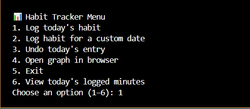

# 🧠 Habit Tracker – Spreadsheet Tools Suite

A real-world Python tool that helps you build better habits by logging daily progress (like coding minutes, workouts, reading, etc.) to beautiful visual graphs using the Pixela API. It includes advanced features like graph switching, undo, custom date entry, and real-time tracking feedback — all integrated into a clean CLI experience.

🧩 This is one of three tools in the **Spreadsheet Tools Suite**, a collection of real-world Python automation projects using Google Sheets or visual dashboards to track personal productivity.

---

## 🎥 Demo


---

## 📸 Screenshot



---

## 🚀 Features

- ✅ Real-time habit logging via Pixela API  
- ✅ Track multiple graphs (e.g., productivity, fitness)  
- ✅ Flexible date input (YYYYMMDD, YYYY-MM-DD, or YYYY/MM/DD)  
- ✅ Undo/delete today's entry  
- ✅ View your current log total for today  
- ✅ Automatically open your graph in a browser  
- ✅ Clean, interactive CLI menu  
- ✅ Secure `.env` usage with `.env.example` provided  

---

## 🧰 Tech Stack

- **Python** – Core scripting language  
- **Pixela API** – Lightweight habit tracking backend  
- **Requests** – For making HTTP requests to the API  
- **Dotenv** – To manage secure environment variables  

---

## 📂 Project Structure

```
habit_tracker/
├── main.py              # Interactive CLI menu for the Habit Tracker
├── habit_api.py         # All Pixela API functions (log, get, delete, open)
├── config.py            # Loads credentials from .env
├── .env.example         # Template for environment variables
├── .gitignore           # Ignore compiled files and .env
├── requirements.txt     # Python dependencies
└── README.md            # Project documentation
```

---

## 🔒 Environment Variables

Create a `.env` file with the following keys:

```
PIXELA_USERNAME=your_pixela_username
PIXELA_TOKEN=your_secure_token
PIXELA_GRAPH_ID=tracker1
```

Use `.env.example` as a template.

---

## 📊 Visual Graphs

Each habit you log is visualized as a clean dot-style graph via Pixela. You can open the graph from the CLI or manually at:

```
https://pixe.la/v1/users/your_username/graphs/your_graph_id.html
```

---

## 🧪 How to Run

1. Clone the repo  
2. Create a Pixela account and graph (or log once via CLI to generate it)  
3. Add your `.env` file  
4. Install dependencies:

```bash
pip install -r requirements.txt
```

5. Run the app:

```bash
python main.py
```

---

## 💡 What I Learned

- Working with REST APIs (Pixela) to post, delete, and fetch data  
- Handling flexible user input formats  
- Building professional interactive CLI tools  
- Tracking habits visually with real-world automation  

---

## 🛠️ Future Improvements

This CLI was designed to practice real-world API integration. In the future, it could evolve into:
- A Flask-based web version with login and dashboard
- Graph filtering by date range or total progress stats
- Daily push notifications for reminders

---

## 👀 Why This Project Matters

This project demonstrates:

- ✅ Real-world API integration  
- ✅ CLI interface design  
- ✅ Automation of daily routines  
- ✅ Visual productivity tracking with persistent storage

It blends software engineering and habit science into a minimalist, professional Python project.
